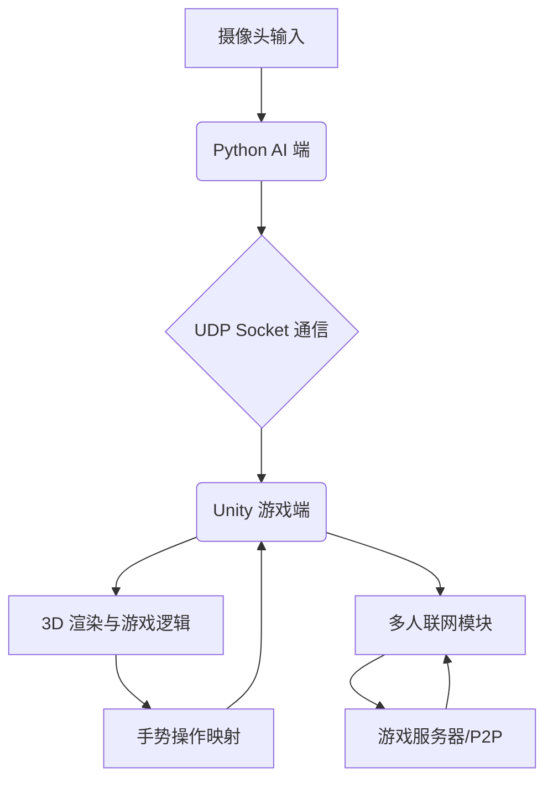

# 项目设计文档：GestureWar - 手势控制 FPS 多人联网游戏

## 1. 项目概述

### 1.1 项目名称
GestureWar (暂定)

### 1.2 项目愿景
通过深度学习手势识别技术，为玩家提供一种全新的、沉浸式的 FPS (第一人称射击) 游戏体验。玩家将通过自然的手部姿态和动作，在虚拟 3D 战场中进行射击、换弹、移动等操作，并与多名玩家进行实时在线对战。

### <h3>1.3 核心目标</h3>
*   实现基于 MediaPipe 的高精度实时手部关键点识别。
*   将手势数据有效映射到 FPS 游戏操作。
*   构建流畅的 3D FPS 游戏场景和角色控制。
*   实现稳定的多人联网通信和游戏状态同步。
*   在 4 周内完成一个可玩的核心原型。

### 1.4 故事背景

在遥远的未来，人类文明高度发展，但资源枯竭和环境恶化引发了全球性的冲突。为了避免全面战争，各大势力决定通过一种全新的“手势战争”来解决争端。

“GestureWar”应运而生，它是一个高度仿真的虚拟战场，玩家通过神经接口与特制的手部识别设备连接，将自己的手势转化为战场上的行动。每一次手势的挥舞，都代表着一次射击、一次换弹、一次战术部署。

你是一名被征召的精英战士，你的任务是进入“GestureWar”的虚拟竞技场，与其他玩家进行对抗，为你的阵营争夺稀缺的能源晶体。在这里，只有最精准的手势、最敏锐的反应和最默契的团队协作，才能赢得最终的胜利。

每一次战斗，都不仅仅是技术的较量，更是意志的考验。你的双手，将决定人类的命运。

## 2. 核心玩法

### 2.1 游戏类型
第一人称射击 (FPS) / 多人在线对战 (MOBA-like Arena Shooter)

### 2.2 游戏场景
小型竞技场地图，包含掩体、高低差等战术元素。

### 2.3 玩家角色
未来风格的士兵，具备基础的移动、射击、换弹、瞄准等能力。

### 2.4 手势操作设计 (初步设想)

| 游戏操作 | 建议手势 (右手) | 识别特征 | 备注 |
| :--- | :--- | :--- | :--- |
| **移动 (前进/后退/左右)** | 左手控制方向 (待定，可能结合键盘或头部追踪) | | 考虑与 FPS 传统移动方式结合，或简化为固定路径移动 |
| **射击** | 食指伸直，其余手指握拳 (模拟手枪) | 食指与中指距离，食指弯曲度 | 快速识别，低延迟 |
| **换弹** | 握拳后迅速张开再握拳 (模拟从腰间取弹匣) | 手部开合速度与幅度 | 需有冷却时间 |
| **瞄准 (ADS)** | 双手模拟持枪姿势，或单手食指与拇指捏合 | 拇指与食指距离 | 提高射击精度 |
| **近战攻击** | 快速挥拳动作 | 手部速度与加速度 | 冷却时间，近距离判定 |
| **切换武器** | 手掌向左/右翻转 | 手掌旋转角度 | 切换主副武器 |
| **特殊技能 (如投掷手雷)** | 特定手势 (如五指张开) | 手指张开程度 | 需有冷却时间 |

### 2.5 游戏流程
1.  玩家进入游戏，选择角色。
2.  匹配其他玩家，进入竞技场。
3.  通过手势进行移动、射击、换弹等操作。
4.  击败对手，获得分数。
5.  规定时间内分数高者获胜。

## 3. 技术架构

### 3.1 整体架构图

### 3.2 Python AI 端 (手势识别与数据处理)
*   **核心库**: MediaPipe 0.10.21 (手部关键点检测), OpenCV (摄像头捕获与图像处理), NumPy (数据处理)。
*   **功能**:
    *   实时捕获摄像头视频流。
    *   使用 MediaPipe 检测手部 (最多两只手) 的 21 个关键点。
    *   对关键点数据进行预处理 (如归一化、平滑滤波 - 考虑 Kalman 滤波减少抖动)。
    *   手势识别模块：根据关键点的位置、距离、角度、运动速度等特征，判断玩家意图。
    *   将识别出的手势指令或原始关键点数据，通过 UDP Socket 发送给 Unity 游戏端。
*   **数据格式**: JSON 字符串，包含手部数量、每个手的关键点坐标、手势识别结果等。

### 3.3 Unity 游戏端 (3D 渲染与游戏逻辑)
*   **核心引擎**: Unity3D。
*   **功能**:
    *   **UDP 数据接收**: 接收 Python 端发送的手部数据。
    *   **数据解析与处理**: 解析 JSON 数据，将关键点数据转换为 Unity 坐标系。
    *   **手势映射**: 将 Python 端识别出的手势指令，或在 Unity 端根据接收到的关键点数据进行二次判断，映射到游戏角色的具体操作 (射击、换弹等)。
    *   **FPS 控制器**: 实现第一人称视角、角色移动、跳跃等基础 FPS 逻辑。
    *   **3D 场景与模型**: 导入并渲染游戏场景、武器模型、角色模型。
    *   **动画系统**: 角色动画 (移动、射击、换弹等) 与手势操作同步。
    *   **UI 系统**: 血量、弹药、分数、小地图等游戏 UI。
    *   **多人联网模块**: 与游戏服务器进行通信，同步玩家位置、动作、生命值等状态。

### 3.4 网络通信 (Python <-> Unity)
*   **协议**: UDP (User Datagram Protocol)。
*   **原因**: UDP 具有低延迟、高效率的特点，适合实时性要求高的手势数据传输。即使少量数据包丢失，也不会对游戏体验造成毁灭性影响。
*   **数据流**: Python 端作为客户端发送数据，Unity 端作为服务器接收数据。

### 3.5 多人联网模块 (Unity <-> 游戏服务器)
*   **架构选择**:
    *   **Client-Server (推荐)**: 建立一个中心服务器来管理游戏状态、玩家连接和数据同步。优点是权威性高，易于防作弊，但需要服务器部署。
    *   **P2P (点对点)**: 玩家之间直接通信。优点是无需中心服务器，但同步复杂，易受作弊影响。
*   **同步内容**: 玩家位置、旋转、射击事件、换弹事件、生命值、分数等。
*   **技术栈**: Unity 提供的网络解决方案 (如 Unity Netcode for GameObjects 或第三方库 Photon PUN/Fusion)。

## 4. 手势设计与映射 (详细)

### 4.1 手势识别精度与鲁棒性
*   **挑战**: 摄像头光照、背景、手部遮挡、不同玩家手型差异。
*   **解决方案**:
    *   在 Python 端对手部关键点进行平滑处理 (如移动平均、Kalman 滤波)。
    *   设计具有高区分度的手势，避免相似手势造成误判。
    *   允许玩家进行手势校准。

### 4.2 手势到操作的映射
*   **射击**: 识别到射击手势后，Unity 端触发武器射击动画和逻辑。
*   **换弹**: 识别到换弹手势后，Unity 端触发换弹动画，并更新弹药数量。
*   **瞄准**: 识别到瞄准手势后，Unity 端切换到 ADS 视角，并调整武器精度。
*   **移动**: 考虑使用左手手势或结合键盘/鼠标进行移动控制。

## 5. 开发计划 (4 周)

### 第 1 周：架构设计与环境搭建 (已完成大部分)
*   **Python 端**:
    *   MediaPipe 0.10.21 环境搭建。
    *   摄像头视频捕获与手部关键点检测原型。
    *   UDP Socket 数据发送原型。
*   **Unity 端**:
    *   Unity 项目搭建，基础 FPS 控制器。
    *   UDP Socket 数据接收与 JSON 解析原型。
    *   手部关键点可视化 (小球)。
*   **文档**: 完成项目设计文档初稿。

### 第 2 周：核心手势识别与游戏操作集成
*   **Python 端**:
    *   实现至少 3-4 个核心手势 (射击、换弹、瞄准) 的识别逻辑。
    *   对手势数据进行初步平滑处理。
    *   优化 UDP 数据传输效率。
*   **Unity 端**:
    *   将 Python 端识别的手势指令映射到 Unity 角色操作。
    *   实现射击、换弹、瞄准的动画和逻辑。
    *   基础武器系统 (弹药、伤害)。

### 第 3 周：多人联网与游戏场景搭建
*   **Unity 端**:
    *   集成多人联网解决方案 (如 Netcode for GameObjects)。
    *   实现玩家位置、旋转、射击事件、换弹事件的同步。
    *   搭建一个简单的多人竞技场地图。
    *   实现基础的玩家生命值和死亡重生逻辑。
*   **Python 端**:
    *   根据 Unity 端需求，调整手势数据发送内容。

### 第 4 周：功能完善、测试与优化
*   **Python 端**:
    *   优化手势识别的鲁棒性和准确性。
    *   增加更多手势或手势组合。
*   **Unity 端**:
    *   完善游戏 UI (血条、弹药、分数板)。
    *   音效与视觉反馈。
    *   游戏平衡性调整。
    *   进行多人联机测试，修复 Bug。
*   **整体**: 性能优化，代码重构，完成最终演示。

## 6. 风险与挑战

*   **手势识别准确性**: 复杂光照、快速动作、手部遮挡可能导致识别率下降。
    *   **对策**: 优化手势识别算法，引入滤波，提供手势校准功能。
*   **游戏延迟**: 摄像头捕获、AI 处理、UDP 传输、Unity 渲染、网络同步等环节都可能引入延迟。
    *   **对策**: 优化各环节性能，使用 UDP，预测性同步。
*   **用户体验**: 新颖的交互方式可能需要玩家适应，手势疲劳。
    *   **对策**: 设计直观、舒适的手势，提供操作反馈，允许自定义手势灵敏度。
*   **多人联网同步**: 复杂的游戏状态同步可能导致不同步问题。
    *   **对策**: 采用权威服务器模式，优化网络代码，进行充分测试。

## 7. 团队分工 (5 人)

以下是一个初步的团队分工建议，可以根据成员特长进行调整：

1.  **AI 算法工程师 (1-2 人)**:
    *   负责 MediaPipe 手部关键点检测与优化。
    *   手势识别算法设计与实现。
    *   Python 端数据处理与 UDP 发送。
    *   手势识别的鲁棒性与性能优化。

2.  **Unity 核心开发 (1-2 人)**:
    *   负责 Unity 游戏逻辑开发 (FPS 控制器、武器系统、游戏状态管理)。
    *   UDP 数据接收与手势映射。
    *   3D 场景搭建与资源整合。
    *   游戏 UI 实现。

3.  **网络与后端开发 (1 人)**:
    *   负责多人联网模块的集成与开发 (Client-Server 架构)。
    *   游戏服务器的搭建与维护 (如果采用)。
    *   数据同步策略的制定与实现。

4.  **美术/UI/UX 设计 (1 人)**:
    *   负责游戏场景、角色、武器等 3D 模型的选择或制作。
    *   游戏 UI 界面设计与实现。
    *   手势操作的视觉反馈设计。
    *   整体用户体验 (UX) 优化。

**注**: 考虑到 4 周工期和 5 人团队，部分角色可能需要兼顾多项任务，或在某些阶段进行协作。例如，Unity 核心开发可能需要协助美术进行场景整合，AI 工程师可能需要协助 Unity 端进行手势映射的调试。

---

这份设计文档将作为你们项目开发的指导方针。请仔细阅读，并根据团队的实际情况进行调整和完善。

接下来，我将把这份文档上传到 GitHub 仓库。
